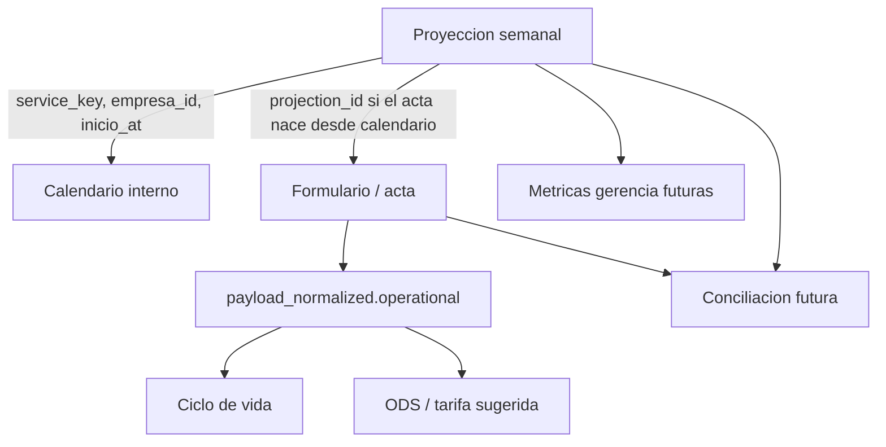

# E3.4a.2 - Contrato Operativo de Servicios y Payload Normalized

**Estado:** propuesto para revision de producto.
**Fecha:** 2026-05-01.
**Base:** inventario E3.4a en `docs/expansion_v2_e3_4a_proyecciones_inventory.md`.
**Alcance:** contrato documental; sin UI, APIs, migraciones ni cambios de formularios.
**No tocar:** `/formularios/*`, `src/components/forms/*`, `src/lib/finalization/*`, `src/app/api/formularios/*`, `src/hooks/use*FormState*`.

## Summary

E3.4a.2 convierte el inventario E3.4a en un contrato comun para conectar calendario, ODS, ciclo de vida y `payload_normalized`.

La idea central es separar tres cosas:

1. **Proyeccion:** lo que el profesional planea hacer.
2. **Acta finalizada:** lo que realmente ocurrio.
3. **Contrato operativo:** campos normalizados que permiten relacionar proyeccion, acta, ciclo de vida y tarifa sin pedir doble trabajo.

Esta fase no implementa nada. Define nombres, responsabilidades y limites para que E3.4b pueda crear modelo/API con menos ambiguedad.

## Decisiones Aprobadas

- Una proyeccion representa un solo servicio/proceso.
- `cantidad_empresas` no entra al modelo inicial: para calendario profesional siempre es 1 empresa.
- `tamano_empresa_bucket` aplica para Evaluacion de Accesibilidad, pero debe capturarse como pregunta opcional y no bloquear el acta.
- `duracion_minutos` pertenece al calendario/proyeccion, no al `payload_normalized` de actas, porque las actas rara vez se llenan mientras el servicio esta ocurriendo.
- `projection_id` solo aparece si el acta nace desde una proyeccion; no se busca ni se infiere durante finalizacion.
- La finalizacion no debe hacer busquedas nuevas en Supabase para conciliar proyecciones.
- La conciliacion proyeccion vs formato finalizado queda para fase posterior.
- Los codigos contables de `tarifas` no son input principal del profesional.
- Los servicios con personas pueden requerir interprete por defecto. Cualquier otro servicio puede solicitar interprete como caso excepcional con justificacion. En la proyeccion esto se maneja con un checkbox y, si aplica, genera una segunda linea vinculada de `interpreter_service`.
- Las modalidades operativas iniciales son `presencial` y `virtual`; `todas_las_modalidades` aplica solo a interpretes.

## Objetivos

1. Definir la lista inicial de `service_key` operativos.
2. Definir como cada `service_key` se conecta con ODS, ciclo de vida, tarifas y formularios.
3. Separar campos que viven en proyecciones de campos que viven en actas.
4. Definir un bloque `operational` futuro dentro de `payload_normalized`.
5. Evitar cualquier cambio que aumente el tiempo critico de finalizacion.
6. Dejar listo el alcance de E3.4b sin adelantar implementacion.

## Fuera de Alcance

- No crear tablas de proyecciones.
- No crear catalogo en Supabase.
- No agregar campos a formularios todavia.
- No modificar `payload_normalized` todavia.
- No cambiar motor ODS.
- No crear conciliacion automatica.
- No tocar Google Calendar ni Google Maps.
- No crear UI.
- No hacer busquedas durante finalizacion.

## Modelo Conceptual



## Contrato Operativo Futuro en `payload_normalized`

El bloque recomendado es `payload_normalized.operational`. Debe ser derivado server-side desde datos existentes o desde contexto interno. No debe exigir trabajo adicional al profesional salvo campos ya capturados por la UI del formulario.

Ejemplo esperado:

```json
{
  "operational": {
    "document_kind": "inclusive_selection",
    "service_key": "inclusive_selection",
    "empresa_id": "uuid-opcional",
    "empresa_match_source": "empresa_id",
    "modalidad_servicio": "presencial",
    "cantidad_personas": 4,
    "numero_seguimiento": null,
    "tamano_empresa_bucket": null,
    "familia_gestion": "compensar",
    "projection_id": null,
    "projection_link_source": null
  }
}
```

### Campos del Bloque `operational`

| Campo | Tipo esperado | Fuente | Obligatorio | Notas |
|---|---|---|---|---|
| `document_kind` | string canonico | tipo de formulario/finalizacion | Si | Es la llave principal para ODS y ciclo de vida. |
| `service_key` | string canonico | matriz operativa | Si | Puede coincidir con `document_kind`, pero se separa para tarifas/servicios. |
| `empresa_id` | uuid nullable | contexto de empresa si existe | No al inicio | Evita matching por NIT/nombre cuando existe. |
| `empresa_match_source` | `empresa_id`, `nit`, `name`, `unknown` | derivado | No | Ayuda a diagnosticar calidad de asociacion. |
| `modalidad_servicio` | `presencial`, `virtual`, `todas_las_modalidades`, `unknown` | formulario o default | No | `todas_las_modalidades` solo aplica a interpretes; si falta queda `unknown`. |
| `cantidad_personas` | number nullable | participantes o campo derivado | No | Aplica a seleccion, contratacion e inducciones cuando sea confiable. |
| `numero_seguimiento` | number nullable | seguimiento | No | Aplica solo a seguimiento. |
| `tamano_empresa_bucket` | `hasta_50`, `desde_51`, `unknown`, null | evaluacion accesibilidad | No | Pregunta opcional futura en Evaluacion. |
| `familia_gestion` | `reca`, `compensar`, `unknown`, null | empresa/caja/formulario | No | Ayuda a ODS y tarifas Compensar/RECA. |
| `projection_id` | uuid nullable | contexto de apertura desde calendario | No | No se busca durante finalizacion. |
| `projection_link_source` | `calendar_context`, null | contexto interno | No | Distingue link directo de futura conciliacion indirecta. |

## Campos que NO Deben Ir en `payload_normalized`

| Campo | Donde vive | Razon |
|---|---|---|
| `duracion_minutos` | proyeccion/calendario | El acta no mide duracion real del servicio. |
| `inicio_at` / `fin_at` | proyeccion/calendario | Son datos de agenda, no de acta finalizada. |
| `estado_proyeccion` | tabla de proyecciones | No pertenece a la evidencia del acta. |
| `cantidad_empresas` | fuera del modelo inicial | La decision actual es una empresa por proyeccion. |
| codigo contable manual | resolucion interna | No debe ser responsabilidad del profesional. |

## `projection_id` sin Aumentar Finalizacion

`projection_id` solo se guarda si ya viene en el contexto del formulario. El sistema no debe hacer una busqueda durante finalizacion para encontrar una proyeccion parecida.

Flujo permitido:

1. Profesional crea proyeccion.
2. Desde el calendario abre `Crear acta desde proyeccion`.
3. El formulario recibe contexto interno con `projection_id`.
4. Al finalizar, el normalizador copia ese `projection_id` a `payload_normalized.operational`.

Flujo no permitido en finalizacion:

1. Profesional finaliza acta manual.
2. El servidor busca en Supabase proyecciones por empresa/fecha/servicio.
3. El servidor actualiza o concilia proyeccion durante la misma finalizacion.

Ese flujo se difiere porque agrega latencia y riesgo al camino critico de finalizacion.

## Impacto Esperado en Finalizacion

El contrato debe respetar esta regla: enriquecer `payload_normalized` solo con datos ya disponibles en memoria o contexto de request.

| Accion | Impacto esperado | Permitido |
|---|---:|---|
| Derivar `document_kind` desde formulario | casi nulo | Si |
| Derivar `service_key` desde matriz local/versionada | casi nulo | Si |
| Contar participantes ya presentes en payload | casi nulo | Si |
| Copiar `projection_id` si viene en contexto | casi nulo | Si |
| Consultar Supabase para buscar proyeccion coincidente | medio/alto | No |
| Actualizar estado de proyeccion al finalizar acta | medio | No en esta fase |
| Resolver tarifa exacta durante finalizacion | medio/alto | No |

## Servicio de Interprete como Linea Vinculada

`interpreter_service` no debe ser una etapa del ciclo de vida ni reemplazar el servicio principal. Es una proyeccion vinculada que puede generarse automaticamente cuando el profesional marca que el servicio principal requiere interprete.

Servicios principales que deben sugerir interprete en el calendario inicial:

- `inclusive_selection`
- `inclusive_hiring`
- `organizational_induction`
- `operational_induction`
- `follow_up`

Regla de excepcion: cualquier otro `service_key` puede marcar `requires_interpreter` si el profesional lo justifica. Esto evita bloquear casos operativos reales sin ampliar el flujo principal.

Matiz importante: `organizational_induction` sigue siendo proceso de empresa para ciclo de vida, no rama por cedula. Aun asi, operativamente puede requerir interprete porque involucra personas en la sesion.

Campos adicionales en la proyeccion principal cuando se marca interprete:

- `requires_interpreter`
- `interpreter_count`
- `interpreter_projected_hours`
- `interpreter_exception_reason` cuando el servicio no esta en la lista principal sugerida.

Comportamiento esperado en E3.4b:

1. El profesional crea una proyeccion de servicio principal.
2. Si marca `requires_interpreter`, el servidor crea una segunda proyeccion vinculada con `service_key = "interpreter_service"`.
3. La proyeccion de interprete guarda `parent_projection_id` apuntando al servicio principal.
4. La proyeccion de interprete usa `modalidad_servicio = "todas_las_modalidades"`.
5. Las horas son proyectadas y pueden reemplazarse por horas reales cuando se cree el acta de interprete.
6. La finalizacion del acta de interprete no debe modificar retroactivamente la proyeccion principal dentro del camino critico.
7. Si el servicio principal no esta en la lista sugerida, `interpreter_exception_reason` debe quedar registrado.

Este diseno permite que calendario y contabilidad vean dos lineas separadas: el servicio principal y el costo/servicio de interprete.

## Lista Inicial de `service_key`

| `service_key` | Nombre operativo | Formato confirma | Ciclo de vida | ODS/tarifa | En calendario inicial |
|---|---|---|---|---|---|
| `program_presentation` | Presentacion del programa | presentacion | etapa empresa | presentacion/promocion | Si |
| `program_reactivation` | Reactivacion | reactivacion | etapa empresa / bitacora | reactivacion/mantenimiento | Si |
| `accessibility_assessment` | Evaluacion de accesibilidad | evaluacion | etapa empresa Compensar | evaluacion accesibilidad | Si, Compensar |
| `vacancy_review` | Condiciones de la vacante | condiciones-vacante | perfil/cargo | revision vacante | Si |
| `inclusive_selection` | Seleccion incluyente | seleccion | persona | seleccion incluyente | Si |
| `inclusive_hiring` | Contratacion incluyente | contratacion | persona | contratacion incluyente | Si |
| `sensibilizacion` | Sensibilizacion | sensibilizacion | etapa empresa Compensar | sensibilizacion | Si, Compensar |
| `organizational_induction` | Induccion organizacional | induccion-organizacional | etapa empresa Compensar | induccion organizacional | Si, Compensar |
| `operational_induction` | Induccion operativa | induccion-operativa | persona | induccion operativa | Si |
| `follow_up` | Seguimiento | seguimientos | persona | seguimiento | Si |
| `interpreter_service` | Servicio de interpretacion LSC | interprete-lsc | servicio transversal | interpretacion LSC | Si, como linea vinculada |
| `failed_visit` | Visita fallida | visita fallida / estado | evento/resultado | visita fallida | Diferir como resultado |
| `special_visit` | Visita adicional / caso especial | evidencia especial | bitacora | visita adicional | Revisar con gerencia |

## Campos por Servicio

| Servicio | Campos en proyeccion | Campos esperados en `operational` | Comentario |
|---|---|---|---|
| Presentacion | empresa, inicio, duracion, modalidad, familia gestion | `document_kind`, `service_key`, `empresa_id`, `modalidad_servicio`, `familia_gestion` | `cantidad_empresas` no aplica: siempre 1. |
| Reactivacion | empresa, inicio, duracion, modalidad, familia gestion | `document_kind`, `service_key`, `empresa_id`, `modalidad_servicio`, `familia_gestion` | Muestra historica baja, pero servicio claro. |
| Evaluacion accesibilidad | empresa, inicio, duracion, modalidad, tamano opcional | `document_kind`, `service_key`, `empresa_id`, `modalidad_servicio`, `tamano_empresa_bucket` | Agregar pregunta opcional al formulario despues. |
| Condiciones vacante | empresa, inicio, duracion, modalidad | `document_kind`, `service_key`, `empresa_id`, `modalidad_servicio`, `cargo_objetivo` fuera de `operational` | El cargo real llega en el acta. |
| Seleccion | empresa, inicio, duracion, modalidad, cantidad personas | `document_kind`, `service_key`, `empresa_id`, `modalidad_servicio`, `cantidad_personas` | Cedulas no se piden en proyeccion. |
| Contratacion | empresa, inicio, duracion, modalidad, cantidad personas | `document_kind`, `service_key`, `empresa_id`, `modalidad_servicio`, `cantidad_personas` | Validacion logica con seleccion queda para conciliacion. |
| Sensibilizacion | empresa, inicio, duracion, modalidad | `document_kind`, `service_key`, `empresa_id`, `modalidad_servicio` | Solo Compensar. |
| Induccion organizacional | empresa, inicio, duracion, modalidad | `document_kind`, `service_key`, `empresa_id`, `modalidad_servicio` | Proceso de empresa. |
| Induccion operativa | empresa, inicio, duracion, modalidad, cantidad opcional | `document_kind`, `service_key`, `empresa_id`, `modalidad_servicio`, `cantidad_personas` si existe | Puede ser por persona, pero no exigir cedula al proyectar. |
| Seguimiento | empresa, inicio, duracion, modalidad, numero seguimiento | `document_kind`, `service_key`, `empresa_id`, `modalidad_servicio`, `numero_seguimiento` | Mejorar captura futura de seguimientos. |
| Interprete LSC | interpretes requeridos, horas proyectadas, proyeccion padre | `document_kind`, `service_key`, `modalidad_servicio`, `projection_id` si nace desde calendario | Se crea como segunda linea vinculada; no es etapa del ciclo de vida. |

## Relacion con ODS

ODS debe poder usar el contrato para reducir inferencias por texto:

- `service_key` reemplaza gran parte de la inferencia por `descripcion_servicio`.
- `modalidad_servicio` reduce ambiguedad de tarifa.
- `cantidad_personas` resuelve buckets de seleccion/contratacion.
- `tamano_empresa_bucket` resuelve evaluacion de accesibilidad.
- `familia_gestion` ayuda a separar RECA/Compensar.
- `interpreter_projected_hours` y `interpreter_count` preparan la linea de interprete para contabilidad futura, pero las horas reales se toman del acta de interprete.

ODS no debe depender de `projection_id`; la proyeccion ayuda a planear y conciliar, pero la tarifa de un acta debe poder resolverse desde el acta finalizada enriquecida.

## Relacion con Ciclo de Vida

El ciclo de vida debe poder consumir `document_kind` y `service_key` para ubicar evidencia sin depender tanto de variantes historicas de `nombre_formato`.

Reglas:

- `vacancy_review` crea rama de perfil/cargo.
- `inclusive_selection`, `inclusive_hiring`, `operational_induction` y `follow_up` alimentan ramas de persona.
- `program_presentation`, `accessibility_assessment`, `sensibilizacion` y `organizational_induction` alimentan etapas de empresa.
- `interpreter_service`, `failed_visit` y `special_visit` no deben entrar al arbol principal sin diseno especifico.
- `interpreter_service` puede aparecer en bitacora o calendario como soporte transversal, pero no como etapa del arbol operativo.

## Relacion con Calendario

Calendario usa `proyecciones`, no `payload_normalized`, como fuente principal.

Campos exclusivos de calendario:

- `inicio_at`
- `fin_at` o `duracion_minutos`
- estado de la proyeccion;
- notas de agenda;
- `requires_interpreter`, `interpreter_count` e `interpreter_projected_hours`;
- `interpreter_exception_reason` cuando aplique;
- `parent_projection_id` cuando el registro es una linea vinculada de interprete;
- futura integracion Google Calendar;
- futura ubicacion/Maps.

Cuando un acta se abre desde calendario, calendario puede pasar `projection_id` al formulario. Esa es la unica union directa en la primera version.

## Fases Siguientes Propuestas

### E3.4a.3 - Validacion del Contrato con ODS y Finalizacion

Fase documental/codigo minimo opcional antes de E3.4b si se necesita bajar riesgo:

- revisar donde se arma `payload_normalized`;
- identificar punto seguro para agregar `operational`;
- confirmar que no requiere queries nuevas durante finalizacion;
- definir tests unitarios futuros por formulario.

### E3.4b - Modelo y API Server-side de Proyecciones

**Estado:** implementado localmente.

E3.4b materializa el contrato de esta fase sin agregar UI:

- `proyeccion_servicios` queda como catalogo versionado, sembrado por migracion y editable a futuro con controles.
- `proyecciones` guarda eventos de agenda internos con empresa, profesional, servicio, horario, duracion, modalidad, estado y campos operativos.
- `interpreter_service` se crea como segunda linea vinculada mediante `parent_projection_id` cuando el servicio principal requiere interprete.
- Las mutaciones de crear, actualizar y cancelar pasan por RPCs transaccionales service-role-only.
- Las APIs `/api/proyecciones*` quedan protegidas por `inclusion_empresas_admin` e `inclusion_empresas_profesional`.
- El catalogo se consulta con cache server-side de TTL corto y conserva respuesta HTTP `private, no-store`.
- La cancelacion es idempotente: una segunda llamada sobre una proyeccion cancelada retorna `already_cancelled` sin sobrescribir la razon original.

Lo que E3.4b mantiene fuera de alcance:

- No modifica `payload_normalized`.
- No escribe `projection_id` en actas.
- No consulta ni actualiza proyecciones durante finalizacion.
- No hace conciliacion proyeccion vs acta.
- No agrega Google Calendar, Google Maps, contabilidad, metricas gerenciales ni UI de calendario.

Deudas documentadas para fases posteriores:

- Deprecar servicios requerira columna o flujo explicito (`active`/`deleted_at`) y auditoria; por ahora `proyectable=false` solo excluye servicios del calendario inicial sin romper historico.
- La bitacora/auditoria de cambios de proyecciones queda para E3.4d o metricas gerenciales.
- Doble booking, rango sensato de fechas, retencion de canceladas e indice `(estado, inicio_at)` se revisan con uso real de E3.4c.
- `GET /api/proyecciones/[id]` puede devolver lineas hijas de interprete por UUID; E3.4c debe decidir si la UI las muestra como detalle propio o solo dentro de la proyeccion principal.

### E3.4c - UI Calendario Profesional

Crear la experiencia de calendario:

- vista mensual, semanal y diaria;
- crear/editar/cancelar proyecciones;
- selector de empresa;
- selector de servicio operativo;
- campos dinamicos por `service_key`.

### E3.4d - Conciliacion

Cruzar proyecciones contra formatos finalizados:

- link directo por `projection_id`;
- fallback por empresa + `service_key` + ventana de fecha;
- marcar cumplida, vencida, cancelada o finalizada sin proyeccion;
- alertas visibles para gerencia, no bloqueantes para profesionales.

## Riesgos

- Si se intenta conciliar durante finalizacion, puede subir latencia y crear fallas en un flujo sensible.
- Si se expone `codigo_servicio` como input, se traslada carga contable al profesional.
- Si se intenta resolver tarifas perfectas antes de tener matriz estable, E3.4b se vuelve contabilidad y no calendario.
- Si se pide cedula/cargo/personas en proyeccion, se crea doble trabajo y baja adopcion.
- Si `payload_normalized.operational` se vuelve obligatorio de golpe para todos los formularios, puede romper legacy; debe entrar como enriquecimiento incremental.

## Criterios de Aprobacion

- La lista inicial de `service_key` queda aprobada o ajustada.
- Los campos de proyeccion quedan separados de los campos de acta.
- Se acepta que `projection_id` solo se copie desde contexto, no se busque en finalizacion.
- Se acepta que `duracion_minutos` vive solo en calendario/proyeccion.
- Se acepta que `cantidad_empresas` sale del modelo inicial.
- Se acepta que interprete se modela como segunda linea vinculada cuando el servicio principal lo requiere.
- Se acepta que `todas_las_modalidades` solo aplica a `interpreter_service`; el resto usa `presencial` o `virtual`.
- Se acepta que `tamano_empresa_bucket` sera una pregunta opcional futura en Evaluacion de Accesibilidad.
- Se acepta que E3.4b no incluira conciliacion, Google Calendar, Google Maps ni metricas gerenciales.

## Verificacion Documental

- `git diff --check`
- `npm run spellcheck`

No requiere suite de tests porque esta fase no toca codigo.
