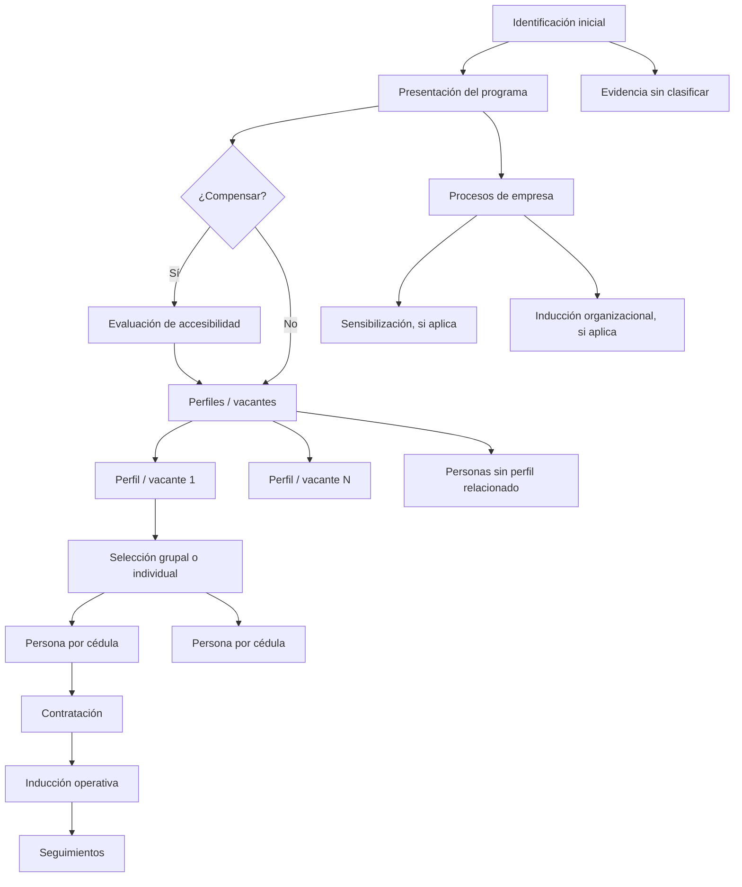

# E3.5a - Inventario del Ciclo de Vida de Empresas

## Estado

Cerrado como fase de inventario y diseño. No implementa UI, APIs nuevas ni migraciones.

Inventario vivo:

`docs/expansion_v2_e3_5a_lifecycle_inventory.md`

Resultado:

El inventario confirma que existe base suficiente para E3.5b como motor read-only conservador. La tabla `formatos_finalizados_il` no tiene `form_slug`; el motor debe normalizar variantes desde `nombre_formato`.

Worktree de trabajo:

`C:\Users\aaron\.config\superpowers\worktrees\INCLUSION_LABORAL_NUEVO\e3-profesionales-empresas`

Rama:

`codex/e3-profesionales-empresas`

## Objetivo

Diseñar la base confiable del ciclo de vida de una empresa antes de construir el árbol visual. La meta es entender qué evidencia ya existe en `formatos_finalizados_il.payload_normalized`, qué se puede inferir con seguridad y qué queda como deuda de captura para fases posteriores.

El ciclo de vida debe exigir el menor trabajo adicional posible a los profesionales. La fuente principal será lo que ya hacen hoy: finalizar actas dentro de la aplicación.

## Decisiones de negocio cerradas

- El ciclo de vida será un árbol operativo de empresa, no una lista lineal.
- La rama inicial por perfil nace de `condiciones-vacante`.
- Una acta de `condiciones-vacante` siempre representa un solo cargo/perfil.
- Las personas aparecen desde `seleccion`, porque ahí existen cédulas.
- Desde que existe cédula, la cédula manda como llave operativa principal. El cargo puede cambiar de texto entre perfil, selección y contratación y no debe romper el árbol.
- Si una persona no puede asociarse de forma confiable a un perfil, se muestra bajo `Personas sin perfil relacionado`.
- No se hará matching difuso agresivo de cargos en esta fase.
- Selección y contratación pueden ser grupales. Una sola acta puede crear o actualizar varias ramas de persona.
- Seguimientos no son grupales. Un acta de seguimiento corresponde a una sola persona.
- El número de seguimiento se inferirá por orden cronológico mientras el formulario de seguimientos no tenga una captura confiable.
- Las personas seleccionadas sin contratación registrada se mantienen visibles por 6 meses y luego pasan a `Ramas archivadas`.
- El cierre manual de ramas/personas/empresa queda fuera de esta primera fase. Cuando se implemente, exigirá nota libre obligatoria.
- Notas y bitácora global se mantienen separadas del árbol por ahora. El árbol muestra evidencia de formularios; las notas siguen en su sección actual.
- Si una evidencia pertenece a la empresa pero no se puede clasificar con confianza, se muestra en `Evidencia sin clasificar`.

## Reglas por tipo de empresa

La columna `caja_compensacion` determina el diferencial:

- `Compensar`:
  - Evaluación de accesibilidad.
  - Sensibilización.
  - Inducción organizacional.
  - 6 seguimientos por persona.
- `No Compensar`:
  - No tiene evaluación de accesibilidad.
  - No tiene sensibilización.
  - No tiene inducción organizacional.
  - 3 seguimientos por persona.

La evaluación de accesibilidad aparece después de presentación del programa. Sensibilización, inducción organizacional, inducción operativa y seguimientos aparecen después de contratación, según aplique.

## Modelo conceptual



## Inventario requerido por formulario

Para cada `form_slug`, el inventario debe revisar muestras reales de `formatos_finalizados_il` y documentar:

- Cómo identifica empresa: NIT, nombre, otros campos.
- Fecha útil: fecha de servicio vs `created_at`.
- Profesional responsable o creador.
- Campos que permiten clasificar etapa.
- Campos que permiten crear perfil/cargo.
- Campos que contienen cédulas/personas.
- Si puede ser grupal o individual.
- Calidad de `payload_normalized`.
- Riesgos de egress o payload grande.
- Decisión: clasificable, parcialmente clasificable o evidencia sin clasificar.

Formularios mínimos a revisar:

- `presentacion`
- `evaluacion`
- `condiciones-vacante`
- `seleccion`
- `contratacion`
- `sensibilizacion`
- `induccion-organizacional`
- `induccion-operativa`
- `seguimientos`

## Contrato de árbol esperado

El inventario debe terminar con un contrato de datos, todavía sin implementación obligatoria:

```ts
type EmpresaLifecycleTree = {
  empresaId: string;
  companyType: "compensar" | "no_compensar" | "unknown";
  companyStages: LifecycleStage[];
  profileBranches: ProfileBranch[];
  peopleWithoutProfile: PersonBranch[];
  archivedBranches: PersonBranch[];
  unclassifiedEvidence: LifecycleEvidence[];
  dataQualityWarnings: LifecycleWarning[];
};
```

El contrato final podrá cambiar durante el inventario, pero debe conservar estas ideas:

- Separar etapas de empresa de ramas por persona.
- Separar evidencia clasificada de evidencia sin clasificar.
- No mezclar notas globales dentro del árbol hasta tener metadata contextual.
- Mantener warnings de calidad de datos para no ocultar huecos.

## Fuera de alcance

- UI de árbol visual.
- Scroll infinito o timeline gráfico.
- APIs nuevas de ciclo de vida.
- Migraciones.
- Cambios a formularios existentes.
- Mejoras al formulario de seguimientos.
- Calendario y proyecciones semanales.
- Cierre manual de ramas o ciclo completo.

## Relación con calendario futuro

Calendario/proyecciones quedan como nota de diseño: más adelante la proyección mínima será empresa, tipo de actividad y cantidad. Cargo o cédulas podrán ser opcionales si el profesional las conoce, pero no serán bloqueantes.

Cuando exista calendario, el sistema podrá conciliar:

- Proyectado y finalizado.
- Finalizado sin proyección.
- Proyectado vencido sin acta.

E3.5a solo debe asegurar que el modelo de evidencia del ciclo no contradiga esa dirección futura.

## Criterios de salida

- Documento de inventario por formulario completado.
- Mapa de llaves confiables y no confiables.
- Reglas de clasificación documentadas.
- Lista de gaps de payload, especialmente en `seguimientos`.
- Recomendación para E3.5b: motor read-only, o más inventario si faltan datos críticos.
- Sin cambios funcionales en producción.

## Verificación esperada

Como esta fase es de inventario, la verificación principal es documental:

- El documento no debe tener placeholders.
- Las reglas no deben contradecir el plan E3 ni las decisiones de negocio.
- Si se hacen consultas a Supabase, deben ser read-only, limitadas y documentadas.
- No se debe tocar `/formularios/*`, `src/components/forms/*`, `src/lib/finalization/*`, `src/app/api/formularios/*` ni hooks de formularios.
